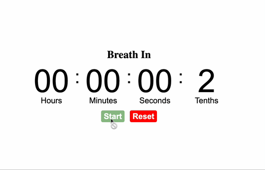

# Resonant-Breathing

https://tphamdo.github.io/Resonant-Breathing/

Simple web app for myself to practice resonant breathing. A practice of breathing slowly, in for 5.5s, out for 5.5s for around 5.5 breaths/min. This idea was inspired by the book [Breath](https://www.amazon.com/Breath-New-Science-Lost-Art/dp/0735213615) by James Nestor

TODOs that will add value to my user experience: 
<ul>
  <li>Add customization for in and out times. For example, it'd be nice to be able to practice longer exhales like 5.5s in and 11s out.</li>
  <li>Make changes b/w in and out more visibly distinct e.g. change color of the screen</li>
  <li>Add a countdown timer for the current in or out breath</li>
  <li>Add pause button</li>
</ul>

idea -> make an android app out of this so this can be used on-the-go without internet
